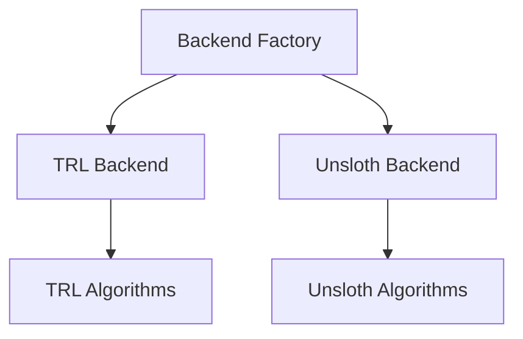

<p align="center">
  
</p>

<div align="center">
  <a href="https://www.python.org/downloads/"></a>
  <a href="https://github.com/Lexsi-Labs/aligntune/blob/main/LICENSE"></a>
  <a href="https://badge.fury.io/py/aligntune"></a>
</div>

---

**AlignTune** is a production-ready fine-tuning library designed to simplify training and fine-tuning of Large Language Models (LLMs) with both Supervised Fine-Tuning (SFT) and Reinforcement Learning (RL) methods. It provides a high-level, unified API that abstracts away the complexities of backend selection, algorithm configuration, and training loops, letting you focus on delivering results.

## Core Features

**Multi-Backend Architecture**: Choose between TRL (reliable, battle-tested) and Unsloth (faster) backends with intelligent auto-selection.

**Complete RLHF Coverage**: 12+ RL algorithms including DPO, PPO, GRPO, GSPO, DAPO, Dr. GRPO, GBMPO, Counterfactual GRPO, and BOLT.

**27+ Reward Functions**: Built-in reward functions for quality, safety, style, and task-specific metrics.

**Production-Ready**: No mock code, comprehensive error handling, extensive testing, and robust validation.

## Quick Start

### Supervised Fine-Tuning (SFT)

```python
from aligntune.core.backend_factory import create_sft_trainer

# Create and train SFT model
trainer = create_sft_trainer(
    model_name="microsoft/DialoGPT-small",
    dataset_name="tatsu-lab/alpaca",
    backend="trl",
    num_epochs=3,
    batch_size=4,
    learning_rate=5e-5
)

# Train the model
trainer.train()

# Evaluate
metrics = trainer.evaluate()
print(metrics)
```

### Reinforcement Learning (DPO)

```python
from aligntune.core.backend_factory import create_rl_trainer

# Create and train DPO model
trainer = create_rl_trainer(
    model_name="microsoft/DialoGPT-small",
    dataset_name="Anthropic/hh-rlhf",
    algorithm="dpo",
    backend="trl",
    num_epochs=1,
    batch_size=4,
    learning_rate=5e-5
)

# Train the model
trainer.train()
```

## Supported Algorithms

| Algorithm | TRL Backend | Unsloth Backend | Description |
|-----------|-------------|-----------------|-------------|
| **SFT** | Yes | Yes | Supervised Fine-Tuning |
| **DPO** | Yes | Yes | Direct Preference Optimization |
| **PPO** | Yes | Yes | Proximal Policy Optimization |
| **GRPO** | Yes | Yes | Group Relative Policy Optimization |
| **GSPO** | Yes | No | Group Sequential Policy Optimization (TRL only) |
| **DAPO** | Yes | Yes | Decouple Clip and Dynamic sAmpling Policy Optimization |
| **Dr. GRPO** | Yes | Yes | GRPO Done Right (unbiased variant) |
| **GBMPO** | Yes | No | Group-Based Mirror Policy Optimization |
| **Counterfactual GRPO** | Yes | Yes | Counterfactual GRPO variant |
| **BOLT** | Yes | Yes | Baseline-Optimized Learning Technique |

## Installation

```bash
# Install from PyPI
pip install aligntune

# Or install from source
git clone https://github.com/Lexsi-Labs/aligntune.git
cd aligntune
pip install -e .
```

### Requirements

- Python 3.8+
- PyTorch 2.0+
- CUDA-compatible GPU (recommended for faster training)

## Demo Notebooks

Interactive Colab notebooks demonstrating various AlignTune workflows:
Here are the organized tables containing the Colab links, models, and datasets provided in your text.

### Supervised Fine-Tuning (SFT)

| Backend| Model | Dataset | Link |
| --- | --- | --- | --- |
| Unsloth| **Qwen/Qwen2.5-0.5B-Instruct** | bebechien/MobileGameNPC | [Open in Colab]( https://colab.research.google.com/drive/11DrRbG30MUCegZTDXwR9nxEdvKaLfWCb%3Fusp%3Dsharing) |
| TRL | **google/txgemma-2b-predict** | trialbench_adverse-event-rate-prediction | [Open in Colab](https://colab.research.google.com/drive/1oTI_0fc3x4u3fs5Q2ccFBc5g45q3ScWY%3Fusp%3Dsharing) |
| Unsloth| **Qwen/Qwen2.5-0.5B-Instruct** | bebechien/MobileGameNP | [Open in Colab](https://colab.research.google.com/drive/15R3JOrzAUuMagCamDHsqe0wNyb44rw2j%3Fusp%3Dsharing) |

### Reinforcement Learning (RL)

| Backend| Algorithm | Model | Dataset | Link |
| --- | --- | --- | --- | --- |
| Unsloth| **PPO** | Qwen/Qwen2.5-0.5B-Instruct | HuggingFaceH4/ultrachat_200k | [Open in Colab](https://colab.research.google.com/drive/1G4fdtO4DhBNwjOYhuaGmvIrBU_lc159H%3Fusp%3Dsharing) |
| TRL | **PPO** | EleutherAI/pythia-1.4b | CarperAI/openai_summarize_tldr | [Open in Colab](https://colab.research.google.com/drive/1wlbSvQAJv8ZFM2qGD4XlUOKPzZHXstQo%3Fusp%3Dsharing) |
| TRL | **GRPO** (Coding) | Qwen/Qwen3-4B | google-research-datasets/mbpp | [Open in Colab](https://colab.research.google.com/drive/1QC-_qMCNNvuYzaNAKk9ARxehvqvqoLcb%3Fusp%3Dsharing) |
| Unsloth| **GRPO** (Math) | meta-llama/Llama-3.2-3B-Instruct | openai/gsm8k | [Open in Colab](https://colab.research.google.com/drive/11tj2odJa7v55VvQkpOlm7_WBclqFdaVi%3Fusp%3Dsharing) |
| TRL | **GRPO** | meta-llama/Llama-3.2-3B-Instruct | openai/gsm8k | [Open in Colab](https://colab.research.google.com/drive/14yCW2grMkOMyIXkubj-uNRPQYKY8ZJX8%3Fusp%3Dsharing) |
| Unsloth | **DRGRPO** | Qwen/Qwen2.5-3B-Instruct | yahma/alpaca-cleaned | [Open in Colab](https://colab.research.google.com/drive/1IzDtjONyL6CZ038faTTp8AvLfhzkqSpb%3Fusp%3Dsharing) |
| TRL | **DRGRPO** | Qwen/Qwen2-0.5B-Instruct | AI-MO/NuminaMath-TIR | [Open in Colab](https://colab.research.google.com/drive/12Pl2SdFq7Rx3eV0UrYgpGlfEsc2zoNP_%3Fusp%3Dsharing) |
| Unsloth | **GSPO** | Qwen/Qwen3-1.7B | CyberNative/Code_Vulnerability_Security_DPO | [Open in Colab](https://colab.research.google.com/drive/120FjMEAZRXUoOMRsWHCn5tmpGfLTAY4g%3Fusp%3Dsharing) |
| TRL | **GSPO** | meta-llama/Llama-3.2-3B-Instruct | HuggingFaceH4/ultrachat_200k | [Open in Colab](https://colab.research.google.com/drive/1vDP7ukBHWwSiD7KVSgSekCvk-x_MkWdC%3Fusp%3Dsharing) |
| Unsloth| **DAPO** | microsoft/Phi-3.5-mini-instruct | HuggingFaceH4/ultrachat_200k | [Open in Colab](https://colab.research.google.com/drive/1gAa6EPc5345XRfog1nzQIFTmp_OJqNvk%3Fusp%3Dsharing) |
|TRL | **DAPO** | meta-llama/Llama-3.2-3B-Instruct | google-research-datasets/mbpp | [Open in Colab](https://colab.research.google.com/drive/1h-PiFWqzEAk66kkizaaeZlps85AN-pbJ%3Fusp%3Dsharing) |
| Unsloth| **DPO** | microsoft/phi-2 | argilla/distilabel-intel-orca-dpo-pairs | [Open in Colab](https://colab.research.google.com/drive/1aKdQzT7KGs0PEr7pO9rOXFkwQK6LzyRZ%23scrollTo%3DdOnIJIAMxP9J) |
| TRL | **DPO** | google/gemma-2-2b-it | Anthropic/hh-rlhf | [Open in Colab](https://colab.research.google.com/drive/1WQhek61Z0v1zHFWT4mQwVX7n10ln-j3d%3Fusp%3Dsharing) |


## Documentation

- **[Getting Started](docs/getting-started/installation.md)**: Installation, setup, and basic usage
- **[User Guide](docs/user-guide/overview.md)**: In-depth tutorials for SFT and RL training
- **[API Reference](docs/api-reference/overview.md)**: Complete Python API and class/method details
- **[Examples](docs/examples/overview.md)**: End-to-end code examples
- **[Advanced Topics](docs/advanced/architecture.md)**: Architecture, custom backends, and performance optimization
- **[Notebooks](docs/notebooks/index.md)**: Interactive Colab notebooks and local Jupyter notebooks

## Key Capabilities

- **Multiple Training Paradigms**: Supports SFT, DPO, PPO, GRPO, and advanced RL algorithms
- **Backend Flexibility**: TRL and Unsloth backends with automatic fallback
- **Reward Model Training**: Train custom reward models from rule-based functions
- **Comprehensive Evaluation**: Multi-level evaluation with lm-eval integration
- **Production Ready**: Model serialization, reproducible training, and deployment-ready pipelines
- **Extensible Architecture**: Modular design for easy integration of custom algorithms and backends

## Architecture

AlignTune uses a flexible backend architecture:



**TRL Backend:** SFT, DPO, PPO, GRPO, GSPO, DAPO, Dr. GRPO, GBMPO, Counterfactual GRPO, BOLT

**Unsloth Backend:** SFT, DPO, PPO, GRPO, DAPO, Dr. GRPO, Counterfactual GRPO, BOLT

See [Architecture](docs/advanced/architecture.md) for details.

## Contributing

We welcome contributions! See our [Contributing Guide](docs/contributing/guide.md) for details.

## License

This project is licensed under the **AlignTune Source Available License (ASAL) v1.0** - see the [LICENSE](LICENSE) file for details.

**Key Points:**
- **Free for Research & Learning**: Use, modify, and study for personal, academic, or research purposes
- **Source Available**: Full access to source code
- **Commercial Use Restricted**: Requires separate commercial license
- **Contact**: For commercial licensing, partnership, or redistribution rights, contact [support@lexsi.ai](mailto:support@lexsi.ai)

This is **not** an open-source license as defined by OSI, but provides broad access for non-commercial use.

## Citation

If you use AlignTune in your research, please cite:

**BibTeX:**
```bibtex
@software{alignTune2025,
  title = {AlignTune: A Comprehensive Fine-Tuning Library for SFT and RL Training},
  author = {Chawla, Chirag and Lyngkhoi, Zera and Seth, Pratinav and Avaiya, Utsav and Bhattacharjee, Soham and Khandoga, Mykola and Yuan, Rui and Sankarapu, Vinay Kumar},
  year = {2025},
  note = {Equal contribution: Chirag Chawla, Zera Lyngkhoi, Pratinav Seth},
  organization = {Lexsi Labs},
  url = {https://github.com/Lexsi-Labs/aligntune},
  version = {0.0.0}
}
```

**Plain Text:**
```
Chawla, C., Lyngkhoi, Z., Seth, P., Avaiya, U., Bhattacharjee, S., Khandoga, M.,
Yuan, R., & Sankarapu, V. K. (2025). AlignTune: A Comprehensive Fine-Tuning Library
for SFT and RL Training. Lexsi Labs. https://github.com/Lexsi-Labs/aligntune

*Equal contribution: Chirag Chawla, Zera Lyngkhoi, Pratinav Seth
```

## Acknowledgments

AlignTune is built upon the excellent work of the following projects:

- **[HuggingFace Transformers](https://github.com/huggingface/transformers)** - Model architectures and tokenizers
- **[TRL](https://github.com/huggingface/trl)** - Transformer Reinforcement Learning library
- **[Unsloth](https://github.com/unslothai/unsloth)** - Fast and memory-efficient training
- **[HuggingFace Datasets](https://github.com/huggingface/datasets)** - Dataset loading and processing

## Support

- **Documentation**: [aligntune.lexsi.ai/](https://aligntune.lexsi.ai/)
- **GitHub Issues**: [github.com/Lexsi-Labs/aligntune/issues](https://github.com/Lexsi-Labs/aligntune/issues)
- **Discussions**: [github.com/Lexsi-Labs/aligntune/discussions](https://github.com/Lexsi-Labs/aligntune/discussions)
- **Email**: [support@lexsi.ai](mailto:support@lexsi.ai)

---

**Get started with AlignTune and accelerate your LLM fine-tuning workflows today!**
