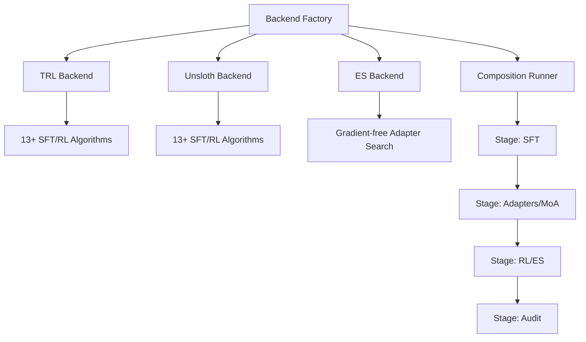

<p align="center">
  
</p>

<div align="center">
  <a href="https://www.python.org/downloads/"></a>
  <a href="https://github.com/Lexsi-Labs/aligntune/blob/main/LICENSE.md"></a>
  <a href="https://badge.fury.io/py/aligntune"></a>
</div>

---

**AlignTune** is the definitive modular ecosystem for the **utility-driven post-training** of Large Language Models. Built for both researchers and production engineers, it abstracts the complexity of disparate training backends into a single, high-performance interface focused on maximizing model reasoning, coding, and mathematical capabilities.

The **Backend Factory** routes each training call to whichever backend (TRL, Unsloth, or ES) has the best kernel support for your algorithm and hardware, so you write one config and don't have to track backend-specific quirks yourself.

## Core Features

**Multi-Backend Architecture**: Route the same training call across TRL (the default, most-tested path), Unsloth (2x speed / 60% memory), or ES (gradient-free) backends.

**Complete RLHF Coverage**: 13+ SFT/RL algorithms including SFT, DPO, Online-DPO, PPO, GRPO, GSPO, DAPO, Dr. GRPO, GBMPO, Counterfactual GRPO, PACE, ORPO, and SPIN — plus RAFT and Distillation (Standard/SDFT).

**Full CLI Surface**: A `typer`-based CLI covering training, recipes, config validation, system diagnostics, cost/VRAM advising, model merging, an interactive training inspector, export/quantization verification, LoRA adapter management, multi-stage compositions, and Indic-language evaluation. See [CLI Reference](docs/cli-reference.md).

**Production-Ready**: every algorithm has been run end-to-end on real models and datasets (see [Changelog](docs/CHANGELOG.md) for specifics), config values are validated before a run starts, and failures raise specific errors instead of failing silently.

### 🏛️ The 9 pillars of AlignTune Utility

AlignTune is built upon nine foundational architectural pillars that ensure production excellence and maximum model utility.

1.  **Unified Backend Factory**: A single API to toggle natively between **TRL** (Reliability), **Unsloth** (2x Speed/60% Memory), and **ES** (Gradient-free).
2.  **Advanced Parameterization**: State-of-the-art PEFT suite featuring **MoA** (Mixture of Adapters), **Text2LoRA**, and **Doc2LoRA**.
3.  **Long Context Infrastructure**: Native support for **RoPE scaling** (Linear, NTK, YaRN), **S2-Attention**, **Sliding Window Attention**, and **Sequence Packing**.
4.  **Utility Advisor**: `aligntune advise`: deterministic VRAM/time/cost/carbon estimation and algorithm recommendation based on your hardware profile, no GPU required.
5.  **Production Compositions**: `aligntune compose` orchestrates multi-stage pipelines (e.g. **SFT → MoA → ES → DPO → audit**) with automated checkpoint threading between stages.
6.  **Factuality & Alignment Auditing**: Specialized probe sets for **hallucination detection** and reasoning accuracy across domain-specific data in **BFSI, Legal, and Healthcare**, plus an `AlignmentAuditor` for tracking alignment metrics during training.
7.  **Model Merging Hub**: Native `aligntune merge` integration for **linear** and **task-arithmetic** merging (via mergekit), plus a dependency-free **LoRA adapter merge**.
8.  **Verifiable-Reward RL (RLVR)**: Built-in verifiable reward functions (math, code execution, SQL, JSON-schema, regex) for GRPO-family training, plus **SPIN** self-play fine-tuning, reducing reliance on human preference labels for reasoning tasks.
9.  **Regional Utility (Indic-Plus)**: Script-aware tokenizer extension for Devanagari, Tamil, Bengali, Telugu, Kannada, and Malayalam, and an `aligntune indic-eval` CLI.

### 🏗️ Technical Manifest (Feature Mapping)

For developers and researchers, here is the direct mapping of features to the AlignTune core:

| Feature | Implementation Path | Technical Detail |
| :--- | :--- | :--- |
| **Backend Selection** | `aligntune.core.backend_factory.BackendFactory` | Dynamic routing to TRL/Unsloth/ES kernels. |
| **Adapters (PEFT)** | `aligntune.core.adapters/` | MoA, Text2LoRA/Doc2LoRA. |
| **RoPE / Packing** | `aligntune.core.long_context/` | RoPE (YaRN/NTK), S2/Sliding-Window Attention, and packing kernels. |
| **Resource Advisor** | `aligntune.core.advisor` / `aligntune.cli.advise` | Deterministic VRAM, time, cost, and carbon profiling. |
| **Compositions** | `aligntune.core.composition/` | Multi-stage pipeline orchestration (`aligntune compose`). |
| **Merging Hub** | `aligntune.core.merge/` | linear/task-arithmetic via `mergekit`, plus LoRA merge. |
| **RAFT** | `aligntune.core.backend_factory.create_raft_trainer` | Retrieval-augmented SFT with golden/distractor document context. Standalone function only. Unlike every other algorithm here, RAFT is not routed through `BackendFactory` itself, and its citation-loss term is a documented no-op. |
| **Verifiable Rewards** | `aligntune.rewards.verifiable` | Math, code-execution, SQL, JSON-schema, and regex reward functions for RLVR. |
| **Indic Tokenization** | `aligntune.core.tokenization/` | Script-aware BPE vocabulary expansion (continued-BPE, naive extension, pruning). |
| **Distillation** | `aligntune.core.distill/` | Standard and SDFT (self-distillation) methods. |
| **Alignment Auditing** | `aligntune.eval.alignment_auditor` | `AlignmentAuditor` / `AlignmentAuditCallback` for BFSI/Legal/Healthcare probes. |
| **ES Rollout** | `aligntune.core.rollout/` | `HFRolloutBackend` / `VLLMRolloutBackend`: pluggable generation engines for Evolution Strategies. |
| **CLI** | `aligntune.cli.unified` | 12 command groups: `train`, `recipes`, `validate`, `diagnose`, `advise`, `merge`, `aligner`, `export`, `verify-export`, `adapters`, `compose`, `indic-eval`. |

> Note: `aligntune.backends.moe` (MoE expert-discovery/router-loss/per-expert-quantization code) exists in the tree but is **not yet wired into the Backend Factory or CLI**, treat it as an internal work-in-progress, not a supported feature.

## Quick Start

### Supervised Fine-Tuning (SFT)

```python
from aligntune.core.backend_factory import create_sft_trainer

# Create and train SFT model
trainer = create_sft_trainer(
    model_name="unsloth/llama-3-8b-bnb-4bit",
    dataset_name="tatsu-lab/alpaca",
    backend="unsloth",  # High-speed specialized kernels
    num_epochs=3,
    max_steps=-1,
    batch_size=4,
    learning_rate=5e-5
)

# Train the model
trainer.train()

# Evaluate
metrics = trainer.evaluate()
print(metrics)
```

### Reinforcement Learning (DPO)

```python
from aligntune.core.backend_factory import create_rl_trainer

# Create and train DPO model
trainer = create_rl_trainer(
    model_name="Qwen/Qwen3-0.6B",
    dataset_name="Anthropic/hh-rlhf",
    algorithm="dpo",   # Swap for "ppo", "grpo", "pace", "raft", etc.
    backend="trl",      # Route to TRL for scale
    num_epochs=1,
    batch_size=4,
    learning_rate=5e-5
)

# Train the model
trainer.train()
```

### The CLI, equivalently

```bash
aligntune train --model unsloth/llama-3-8b-bnb-4bit --dataset tatsu-lab/alpaca --backend unsloth --type sft --epochs 3

# Before committing GPU time, sanity-check the plan:
aligntune advise estimate --model Qwen/Qwen2.5-7B --dataset-size 10000 --algorithm grpo
aligntune validate config my_config.yaml
```

## Supported Algorithms

AlignTune supports **13+ state-of-the-art SFT/RL algorithms** with intelligent backend routing.

| Algorithm | TRL | Unsloth | Description |
| :--- | :---: | :---: | :--- |
| **SFT** | ✅ | ✅ | Standard Supervised Fine-Tuning |
| **DPO** | ✅ | ✅ | Direct Preference Optimization |
| **Online-DPO** | ✅ | ✅ | Iterative/Online variant of DPO |
| **PPO** | ✅ | ✅ | Proximal Policy Optimization |
| **GRPO** | ✅ | ✅ | Group-Relative Policy Optimization |
| **GBMPO** | ✅ | ✅ | Group-Based Mirror PO — unified config, 4 divergence types (L2/L2KL/ProbL2/ProbL2KL) |
| **Counterfactual GRPO** | ✅ | ✅ | Counterfactual variant of Group-Relative PO |
| **PACE** | ✅ | ✅ | High-efficiency Baseline-Optimized Learning |
| **GSPO** | ✅ | ✅ | Group Sequential Policy Optimization |
| **DAPO** | ✅ | ✅ | Decoupled-Clip Dynamic-Sampling PO |
| **Dr. GRPO** | ✅ | ✅ | GRPO Done Right (Unbiased variant) |
| **SPIN** | ✅ | ✅ | Self-Play Fine-Tuning |
| **ORPO** | ✅ | ✅ | Odds-Ratio Preference Optimization |
| **RAFT** | ✅* | ✅* | Retrieval Augmented Fine-Tuning (document-grounded SFT) |
| **Distillation** | ✅ | ✅ | Knowledge Distillation (Standard, SDFT) |


- **RAFT**: core SFT training works, but you can only reach it through the standalone `create_raft_trainer()` function. Unlike every other algorithm, it is **not** wired into `BackendFactory`. Its citation-loss term (`use_citation_loss=True`) is also a documented placeholder with no numerical effect.

See the [Algorithm Zoo](docs/algorithms/overview.md) for the full comparison table and selection guide.

## Installation

```bash
# Or install from source
git clone https://github.com/Lexsi-Labs/aligntune.git
cd aligntune
pip install -e .
```

Or with `uv`:

```bash
pip install uv
uv pip install -e .
```

CuratorKIT (data curation: schema gating, cleaning, dedup), `mergekit`
(model merging, notebooks 35-42), and Unsloth (`unsloth`/`unsloth_zoo`) are
all already included in `dependencies` and install automatically with the
single `pip install -e .` / `uv pip install -e .` above - no separate step
needed.

`mergekit` is vendored *as part of the `aligntune` package itself* (under
`third_party/mergekit`, built into the same wheel/editable install rather
than installed as a second distribution) with two small patches for
compatibility with this project's transformers/pydantic versions (see
`third_party/mergekit/PATCH_NOTES.md`).

`unsloth` and `unsloth_zoo` are vendored the same way (under
`third_party/unsloth` and `third_party/unsloth_zoo`): Unsloth's published
metadata caps `transformers<=5.5.0` and `trl<=0.24.0`, while this project
pins `transformers==5.14.1` and `trl==1.7.1`; vendoring sidesteps that cap
the same way `--no-deps` did previously, but without needing a second
install command. See `third_party/unsloth/PATCH_NOTES.md` and
`third_party/unsloth_zoo/PATCH_NOTES.md` for the patches applied.

### Requirements

- Python 3.11+
- PyTorch 2.0+
- CUDA-compatible GPU (recommended for faster training)

## Local Notebooks

Beyond the Colab demos below, `notebooks/` ships **46 local runnable notebooks** — one per algorithm/technique (SFT, every RL algorithm, adapters, merging, long-context, tokenization). Each is a quick, tiny-model smoke test, runnable straight from the repo:

```bash
jupyter notebook notebooks/
```

Full breakdown by number range: **[docs/notebooks.md](docs/notebooks.md)**.

## Demo Notebooks

Interactive Colab notebooks covering SFT and RL workflows, organized by algorithm below.

### Supervised Fine-Tuning (SFT)

| Backend| Model | Dataset | Link |
| --- | --- | --- | --- |
| TRL | **Qwen/Qwen3-4B-Instruct-2507** | sohamb37lexsi/bitext-wealth-management-llm-chatbot-splits | [](https://colab.research.google.com/drive/1okAnfMlkch-G5Dy2dmj_dfR07rtxmYoq?usp=sharing) |
| TRL | **Qwen3-4B-Instruct** | sohamb37lexsi/bitext-retail-banking-llm-chatbot-splits | [](https://colab.research.google.com/drive/1JnFvEWZ6PDqrDAyWznCdOA9oNn8aqN2v?usp=sharing) |
| Unsloth| **Qwen/Qwen2.5-0.5B-Instruct** | bebechien/MobileGameNPC | [](https://colab.research.google.com/drive/15R3JOrzAUuMagCamDHsqe0wNyb44rw2j?usp=sharing) |
| TRL | **google/txgemma-2b-predict** | trialbench_adverse-event-rate-prediction | [](https://colab.research.google.com/drive/1oTI_0fc3x4u3fs5Q2ccFBc5g45q3ScWY?usp=sharing) |
| Unsloth| **Qwen/Qwen2.5-0.5B-Instruct** | bebechien/MobileGameNP |[](https://colab.research.google.com/drive/11DrRbG30MUCegZTDXwR9nxEdvKaLfWCb?usp=sharing) |

### Reinforcement Learning (RL)

| Backend| Algorithm | Model | Dataset | Link |
| --- | --- | --- | --- | --- |
| Unsloth| **DPO** | microsoft/phi-2 | argilla/distilabel-intel-orca-dpo-pairs | [](https://colab.research.google.com/drive/1aKdQzT7KGs0PEr7pO9rOXFkwQK6LzyRZ#scrollTo=dOnIJIAMxP9J) |
| TRL | **DPO** | google/gemma-2-2b-it | Anthropic/hh-rlhf | [](https://colab.research.google.com/drive/1WQhek61Z0v1zHFWT4mQwVX7n10ln-j3d?usp=sharing) |
| TRL | **DPO** | sohamb37lexsi/wealth_management_Qwen3-4B-Instruct-2507 | sohamb37lexsi/bitext_wealth_management_preference_data | [](https://colab.research.google.com/drive/1LR3KWcjQAFjSHf0MR9271ShchjPUVSpS?usp=sharing) |
| Unsloth| **PPO** | Qwen/Qwen2.5-0.5B-Instruct | HuggingFaceH4/ultrachat_200k | [](https://colab.research.google.com/drive/1G4fdtO4DhBNwjOYhuaGmvIrBU_lc159H?usp=sharing) |
| TRL | **PPO** | EleutherAI/pythia-1.4b | CarperAI/openai_summarize_tldr | [](https://colab.research.google.com/drive/1Wwk8lxtzP-xzOwIIgxYrUjQ1i4J_N6ZO?usp=sharing) |
| TRL | **GRPO** (Coding) | Qwen/Qwen3-4B | google-research-datasets/mbpp | [](https://colab.research.google.com/drive/13HYZ-EkLC3-6wxJG_1NyWXPEuN9bIeM4?usp=sharing) |
| Unsloth| **GRPO** (Math) | meta-llama/Llama-3.2-3B-Instruct | openai/gsm8k | [](https://colab.research.google.com/drive/1mpG2gbHjk5CaSKkuoQFXxDY0fzFVIilb?usp=sharing) |
| TRL | **GRPO** | meta-llama/Llama-3.2-3B-Instruct | openai/gsm8k | [](https://colab.research.google.com/drive/14b2dt0_iSVL8Z_8mlOx--f-d_rDCqVOP?usp=sharing) |
| Unsloth | **DRGRPO** | Qwen/Qwen2.5-3B-Instruct | yahma/alpaca-cleaned | [](https://colab.research.google.com/drive/1fAFF9LAyQw0sJfxQTE_HLaF0Xl56hfsG?usp=sharing) |
| TRL | **DRGRPO** | Qwen/Qwen2-0.5B-Instruct | AI-MO/NuminaMath-TIR | [](https://colab.research.google.com/drive/1KfrMzuGRPrZwyRuNTGep1ZL6C6h2aVjk?usp=sharing) |
| Unsloth | **GSPO** | Qwen/Qwen3-1.7B | CyberNative/Code_Vulnerability_Security_DPO | [](https://colab.research.google.com/drive/1k9UjIqdNClnGADeJzfVUeE6UVgjzc5wV?usp=sharing) |
| TRL | **GSPO** | meta-llama/Llama-3.2-3B-Instruct | HuggingFaceH4/ultrachat_200k | [](https://colab.research.google.com/drive/1k9UjIqdNClnGADeJzfVUeE6UVgjzc5wV?usp=sharing) |
| Unsloth| **DAPO** | microsoft/Phi-3.5-mini-instruct | HuggingFaceH4/ultrachat_200k | [](https://colab.research.google.com/drive/1gAa6EPc5345XRfog1nzQIFTmp_OJqNvk?usp=sharing) |
|TRL | **DAPO** | meta-llama/Llama-3.2-3B-Instruct | google-research-datasets/mbpp | [](https://colab.research.google.com/drive/1aF3LxEMmLl0fCyA5yVBAkU_Rgsy3dsh5?usp=sharing) |

### Additional Feature & Algorithm Demos

| Notebook | Link |
| --- | --- |
| Tokenization Trainer | [](https://colab.research.google.com/drive/1RxBVqXgfcp8UzdNE27XZQpknwOmG2qGS?usp=sharing) |
| Embedding Training (Extension) | [](https://colab.research.google.com/drive/1Fccrynx2lifVDjTycifYMQ4PjEtqvXQA?usp=sharing) |
| Rope Scaling | [](https://colab.research.google.com/drive/1d-3HCq4H9mY6jDg5ezr4k34XypNdR66t?usp=sharing) |
| Offline Distillation | [](https://colab.research.google.com/drive/1PB3jBKoc1bKi5_8qB3KgKCedMqA1P-rT?usp=sharing) |
| Online Distillation | [](https://colab.research.google.com/drive/1ge7mE9o1MwYM-2I8oflSlZJcDfJS38bq?usp=sharing) |
| SWA Attention (long context) | [](https://colab.research.google.com/drive/1TgEb40JU43oAiZKdH3wgiJVUpnbk74IC?usp=sharing) |
| S2 Attention (long context) | [](https://colab.research.google.com/drive/1ZtshdGOMC4ON1I3d-uy-_PI0_ENp6k_h?usp=sharing) |

### Further Resources

*   **[CLI Reference](docs/cli-reference.md)**: All 12 command groups, `train`, `recipes`, `validate`, `diagnose`, `advise`, `merge`, `aligner`, `export`, `verify-export`, `adapters`, `compose`, `indic-eval`.
*   **[Algorithm Zoo](docs/algorithms/overview.md)**: full comparison table and selection guide for every supported alignment method.
*   **[Novelty Frontiers](docs/novelty_frontiers.md)**: 2026 research roadmap (forward-looking, not yet implemented).

## Documentation

- **[Getting Started](docs/getting-started/installation.md)**: Installation, setup, and basic usage
- **[User Guide](docs/user-guide/overview.md)**: In-depth tutorials for SFT and RL training
- **[API Reference](docs/api-reference/overview.md)**: Complete Python API and class/method details
- **[CLI Reference](docs/cli-reference.md)**: Full command-line interface reference
- **[Examples](docs/examples/overview.md)**: End-to-end code examples
- **[Advanced Topics](docs/advanced/architecture.md)**: Architecture, custom backends, and performance optimization
- **[Notebooks](docs/notebooks/local.md)**: Interactive Colab notebooks and local Jupyter notebooks
- **[Hyperparameter Reference](docs/PARAMETERS.md)**: Every configuration parameter, organized by training type and algorithm
- **[Unsloth Compatibility](docs/unsloth_compatibility.md)**: Supported versions, known per-algorithm issues, and troubleshooting
- **[Changelog](docs/CHANGELOG.md)**: Detailed, PR-by-PR change history

## Key Capabilities

- **Multiple Training Paradigms**: SFT, DPO, PPO, GRPO, RAFT, and 15+ other RL algorithms
- **Backend Flexibility**: TRL, Unsloth, and ES backends with automatic fallback
- **Reward Model Training**: Train custom reward models, including verifiable (RLVR) rewards
- **Comprehensive Evaluation**: Multi-level evaluation with lm-eval integration and Indic-language benchmarks
- **Production Ready**: Model serialization, reproducible training, and deployment-ready pipelines (GGUF/Ollama/HF Hub export)
- **Extensible Architecture**: Modular design for easy integration of custom algorithms and backends

### 🧬 Regional Specialization (Indic-Plus)

AlignTune is uniquely architected for South Asian linguistic utility, moving beyond simple evaluation:

*   **Tokenizer Extender**: Native extension of base model vocabularies (Llama-3/Mistral) using **script-aware BPE merges** for Devanagari, Tamil, Bengali, Telugu, Kannada, and Malayalam.
*   **Utility Benchmarks**: Post-training validation via `aligntune indic-eval` against MILU, IndicXTREME, and IndicGenBench.

See [Indic / Regional Post-Training](docs/advanced/indic.md) for details.

## Architecture

AlignTune uses a flexible backend architecture:


```mermaid
flowchart TD
    Factory[Backend Factory] --> TRL[TRL Backend]
    Factory --> Unsloth[Unsloth Backend]
    Factory --> ES[ES Backend]
    TRL --> TRL_Algos[13+ SFT/RL Algorithms]
    Unsloth --> Unsloth_Algos[13+ SFT/RL Algorithms]
    ES --> ES_Algos[Gradient-free Adapter Search]
    Factory --> Compose[Composition Runner]
    Compose --> Stage1[Stage: SFT] --> Stage2[Stage: Adapters/MoA] --> Stage3[Stage: RL/ES] --> Stage4[Stage: Audit]
```

**TRL Backend:** SFT, DPO, Online-DPO, PPO, GRPO, GSPO, DAPO, Dr. GRPO, GBMPO, Counterfactual GRPO, PACE, ORPO, SPIN, RAFT, Distillation

**Unsloth Backend:** SFT, DPO, Online-DPO, PPO, GRPO, GSPO, DAPO, Dr. GRPO, GBMPO, PACE, ORPO, SPIN, RAFT (see [Supported Algorithms](#supported-algorithms))

See [Architecture](docs/advanced/architecture.md) for details.

## Contributing

We welcome contributions! See our [Contributing Guide](docs/contributing/guide.md) for details.

## License

This project is released under the **Lexsi Labs Source Available License (LSAL) v1.1**. Please cite appropriately if used in academic or production projects.
See the [LICENSE.md](LICENSE.md) file for details, and [THIRD_PARTY_LICENSES.md](THIRD_PARTY_LICENSES.md) for vendored/third-party components (mergekit, CuratorKIT, Unsloth, etc.).

**Key Points:**
- **Free for Research & Learning**: Use, modify, and study for personal, academic, or research purposes
- **Source Available**: Full access to source code
- **Commercial Use Restricted**: Requires separate commercial license
- **Contact**: For commercial licensing, partnership, or redistribution rights, contact [support@lexsi.ai](mailto:support@lexsi.ai)

This is **not** an open-source license as defined by OSI, but provides broad access for non-commercial use.

## Citation

If you use AlignTune in your research, please cite:

**BibTeX:**
```bibtex
@software{alignTune2025,
  title        = {{AlignTune}: Modular Toolkit for Post-Training Alignment of Large Language Models},
  author       = {Goyal, Bhavya and Lyngkhoi, R E Zera Marveen and Chawla, Chirag and Seth, Pratinav and Avaiya, Utsav and Bhattacharjee, Soham and Khandoga, Mykola and Yuan, Rui and Sankarapu, Vinay Kumar},
  year         = {2025},
  note         = {Equal contribution: Bhavya Goyal, R E Zera Marveen Lyngkhoi, Chirag Chawla, Pratinav Seth},
  organization = {Lexsi Labs},
  url          = {https://github.com/Lexsi-Labs/aligntune},
  version      = {0.0.0}
}
```

**Plain Text:**
```
Goyal, B., Lyngkhoi, R. E. Z. M., Chawla, C., Seth, P., Avaiya, U., Bhattacharjee, S.,
Khandoga, M., Yuan, R., & Sankarapu, V. K. (2025). AlignTune: Modular Toolkit for
Post-Training Alignment of Large Language Models. Lexsi Labs. https://github.com/Lexsi-Labs/aligntune

*Equal contribution: Bhavya Goyal, R E Zera Marveen Lyngkhoi, Chirag Chawla, Pratinav Seth
```

## Acknowledgments

AlignTune is built upon the excellent work of the following projects:

- **[HuggingFace Transformers](https://github.com/huggingface/transformers)** - Model architectures and tokenizers
- **[TRL](https://github.com/huggingface/trl)** - Transformer Reinforcement Learning library
- **[Unsloth](https://github.com/unslothai/unsloth)** - Fast and memory-efficient training
- **[HuggingFace Datasets](https://github.com/huggingface/datasets)** - Dataset loading and processing
- **[mergekit](https://github.com/arcee-ai/mergekit)** - linear/task-arithmetic model merging

## Support

- **Documentation**: [aligntune.lexsi.ai/](https://aligntune.lexsi.ai/)
- **GitHub Issues**: [github.com/Lexsi-Labs/aligntune/issues](https://github.com/Lexsi-Labs/aligntune/issues)
- **Discussions**: [github.com/Lexsi-Labs/aligntune/discussions](https://github.com/Lexsi-Labs/aligntune/discussions)
- **Email**: [hello@lexsi.ai](mailto:hello@lexsi.ai)
- **Discord**: [Discord Lexsi Labs](https://discord.gg/ckVbEJGW)

## Contact

<div align="center">
  <a href="https://lexsi.ai/">
    
  </a>
  <br>
  <a href="https://lexsi.ai/">https://www.lexsi.ai</a>
  <br><br>
  Paris 🇫🇷 · Mumbai 🇮🇳 · London 🇬🇧
  <br><br>
</div>
