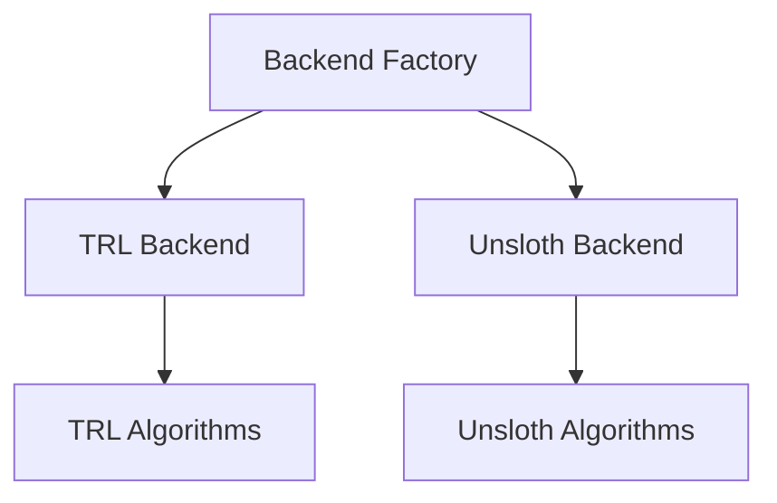
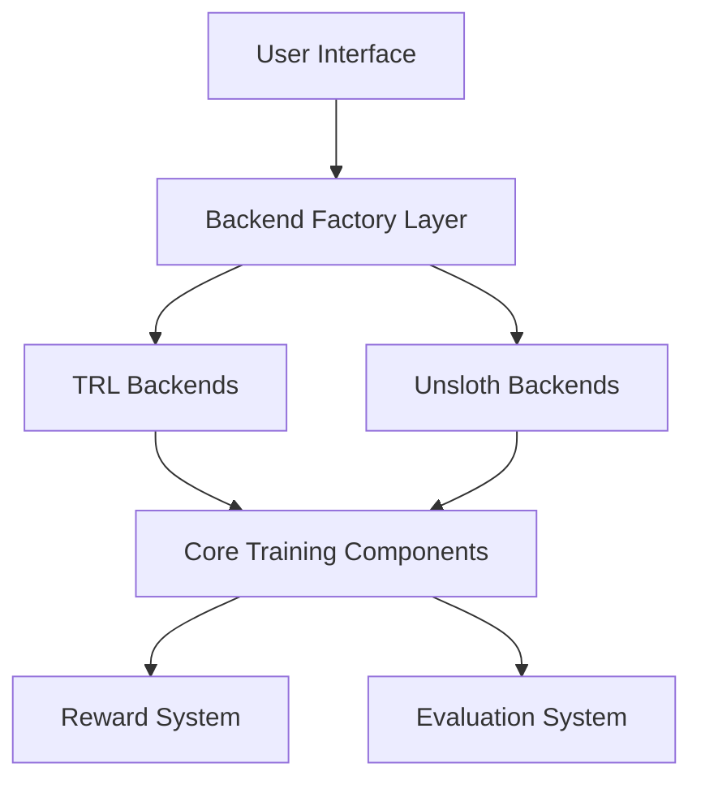

# Architecture Overview

Complete architecture documentation for AlignTune.

## System Architecture

### High-Level Overview

AlignTune uses a flexible backend architecture:



**TRL Backend supports:**
- SFT, DPO, PPO, GRPO, GSPO, DAPO, Dr. GRPO

**Unsloth Backend supports:**
- SFT, DPO, PPO, GRPO, DAPO, Dr. GRPO

**Note:** GSPO is a TRL-only algorithm.

### Complete System Architecture



## Core Components

### 1. Backend Factory

The backend factory provides a unified interface for creating trainers:

- **Backend Selection**: Automatic or manual backend selection
- **Configuration Management**: Unified configuration system
- **Fallback Handling**: Automatic fallback to available backends

**Key Classes:**
- `BackendFactory`: Main factory class
- `BackendConfig`: Backend configuration
- `create_sft_trainer()`: SFT trainer creation
- `create_rl_trainer()`: RL trainer creation

### 2. Configuration System

Unified configuration system with type safety:

- **SFT Configuration**: `SFTConfig`, `ModelConfig`, `DatasetConfig`, `TrainingConfig`
- **RL Configuration**: `UnifiedConfig`, algorithm-specific configs
- **Validation**: Comprehensive validation with clear error messages

### 3. Training Backends

#### TRL Backends

- Pure TRL implementations
- Maximum compatibility
- Battle-tested reliability
- Supports all core algorithms (DPO, PPO, GRPO, GSPO, DAPO, Dr. GRPO)

#### Unsloth Backends

- faster training
- Memory efficient
- Optimized kernels
- Supports DPO, PPO, GRPO, DAPO, Dr. GRPO (not GSPO)

### 4. Reward System

- **27+ Pre-built Functions**: Length, sentiment, safety, etc.
- **Composite Rewards**: Combine multiple functions
- **Custom Functions**: Extensible reward system
- **Reward Model Training**: Train neural reward models

### 5. Evaluation System

- **Training Evaluation**: Automatic during training
- **Standalone Evaluation**: Evaluate saved models
- **Benchmark Integration**: lm-eval integration
- **Custom Tasks**: Task-specific evaluation

## Design Patterns

### Factory Pattern

Backend selection uses the factory pattern:

```python
# Factory creates appropriate trainer
trainer = BackendFactory.create_trainer(config, backend_config)
```

### Strategy Pattern

Different backends implement the same interface:

```python
# Both backends implement TrainerBase
class TRLSFTTrainer(SFTTrainerBase): ...
class UnslothSFTTrainer(SFTTrainerBase): ...
```

### Registry Pattern

Reward functions use registry pattern:

```python
# Register and retrieve functions
RewardRegistry.register_reward("custom", CustomReward)
func = RewardRegistry.get_reward_function("custom")
```

## Data Flow

### Training Flow

```
1. User creates trainer via factory
2. Factory selects backend
3. Backend loads model and dataset
4. Training loop executes
5. Metrics logged and checkpoints saved
6. Model saved to disk
```

### Evaluation Flow

```
1. Load model and evaluation dataset
2. Run inference on dataset
3. Compute metrics
4. Return results
```

## Extension Points

### Custom Backends

Create custom backends by implementing trainer base classes:

```python
class CustomSFTTrainer(SFTTrainerBase):
 def train(self): ...
 def evaluate(self): ...
```

### Custom Reward Functions

Extend reward system with custom functions:

```python
class CustomReward(RewardFunction):
 def compute(self, text: str) -> float: ...
```

### Custom Evaluation Tasks

Add custom evaluation tasks:

```python
task = EvalTask(
 name="custom",
 category=TaskCategory.CUSTOM,
 ...
)
```

## Next Steps

- [Custom Backends](custom-backends.md) - Creating custom backends
- [Distributed Training](distributed.md) - Distributed training architecture
- [Performance](performance.md) - Performance optimization