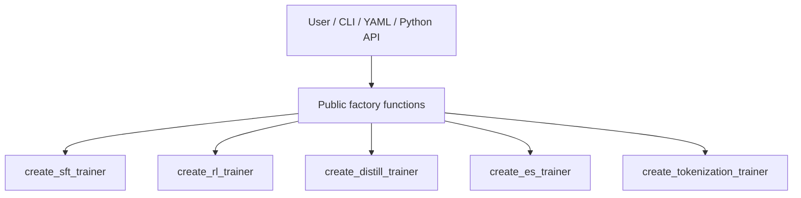
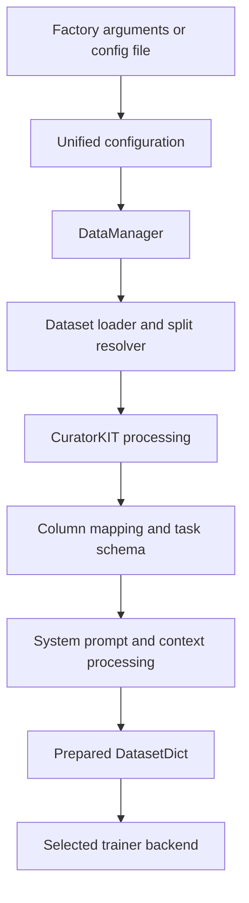
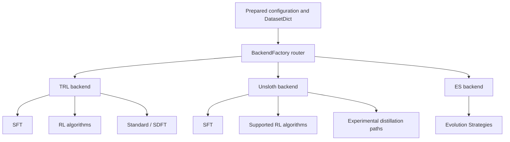
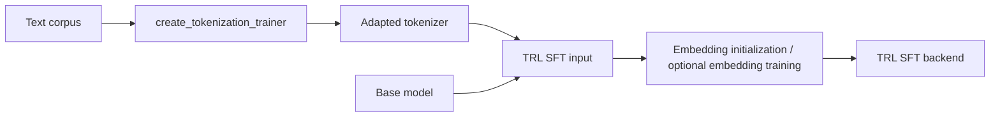
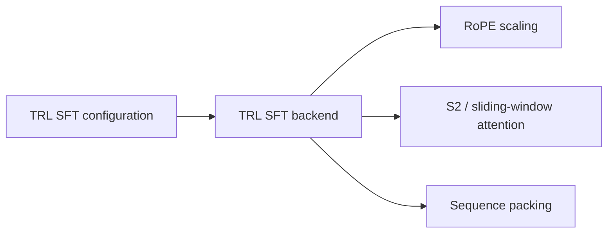

# Architecture Overview

AlignTune provides a unified configuration and factory layer over several
training workflows. The public API keeps dataset preparation and trainer
construction consistent while allowing each backend to use its native trainer.

## Public Entry Points


```mermaid
flowchart TD
    User[User / CLI / YAML / Python API] --> Factory[Public factory functions]
    Factory --> SFT[create_sft_trainer]
    Factory --> RL[create_rl_trainer]
    Factory --> Distill[create_distill_trainer]
    Factory --> ES[create_es_trainer]
    Factory --> Tokenization[create_tokenization_trainer]
```

The first four factory paths are registered in `BackendFactory`. Tokenization
is a separate specialized workflow with its own configuration and trainer; it
does not use the TRL/Unsloth backend registration table.

## Shared Data and Configuration Flow


```mermaid
flowchart TD
    Input[Factory arguments or config file] --> Unified[Unified configuration]
    Unified --> Manager[DataManager]
    Manager --> Loader[Dataset loader and split resolver]
    Loader --> Curator[CuratorKIT processing]
    Curator --> Mapping[Column mapping and task schema]
    Mapping --> Prompt[System prompt and context processing]
    Prompt --> Dataset[Prepared DatasetDict]
    Dataset --> Trainer[Selected trainer backend]
```

For SFT, RL, and distillation, `DataManager` is responsible for loading the
dataset, applying CuratorKIT processing, normalizing columns, creating ratio-
based splits, injecting system prompts, and preparing the task-specific
schema. Distillation tasks additionally preserve `privileged_context` when it
is required by SDFT.

## Backend Routing


```mermaid
flowchart TD
    Dataset[Prepared configuration and DatasetDict] --> Router[BackendFactory router]
    Router --> TRL[TRL backend]
    Router --> Unsloth[Unsloth backend]
    Router --> ESBackend[ES backend]

    TRL --> SFT_T[SFT]
    TRL --> RL_T[RL algorithms]
    TRL --> Distill_T[Standard / SDFT]

    Unsloth --> SFT_U[SFT]
    Unsloth --> RL_U[Supported RL algorithms]
    Unsloth --> Distill_U[Experimental distillation paths]

    ESBackend --> ES_T[Evolution Strategies]
```

See [Backends Overview](../backends/overview.md) for what each backend is
best for, its `backend=` identifier, and usage examples, this page covers
only how the factory routes between them.

## Tokenization and Long Context

These are two related but separate capabilities.

### Tokenization workflow

`create_tokenization_trainer()` is a standalone vocabulary-adaptation workflow.
It consumes a corpus and produces an adapted tokenizer; it does not run SFT or
modify model weights itself.


```mermaid
flowchart LR
    Corpus[Text corpus] --> TokenizerTrainer[create_tokenization_trainer]
    TokenizerTrainer --> ExtendedTokenizer[Adapted tokenizer]
    ExtendedTokenizer --> SFTInput[TRL SFT input]
    BaseModel[Base model] --> SFTInput
    SFTInput --> Embeddings[Embedding initialization / optional embedding training]
    Embeddings --> SFT[TRL SFT backend]
```

Vocabulary extension and pruning happen in the tokenization workflow. FVT
embedding initialization and optional embedding training happen later during
model loading and the TRL SFT workflow.

### Long-context workflow

Long-context controls are currently exposed through the **TRL SFT backend**:


```mermaid
flowchart LR
    SFTConfig[TRL SFT configuration] --> TRLSFT[TRL SFT backend]
    TRLSFT --> RoPE[RoPE scaling]
    TRLSFT --> S2[S2 / sliding-window attention]
    TRLSFT --> Packing[Sequence packing]
```

These long-context controls are not general backend features. They should not
be assumed to work for RL, distillation, ES, tokenization, or the Unsloth
backend unless a specific algorithm page states otherwise.

## Shared Services

The following services support multiple workflows but are not themselves
training backends:

- **Model loading and PEFT**: model/tokenizer loading, quantization, LoRA, and
  adapter setup.
- **Rewards**: registry functions, custom reward functions, and the TRL reward
  bridge used by RL.
- **Evaluation**: generation metrics, task evaluators, and benchmark runners.
- **Callbacks and logging**: progress, sample logging, checkpointing, and
  reporting integrations.
- **Export and model management**: saving adapters/models and publishing
  artifacts.

## Design Principles

### Factory strategy

The factory exposes a stable public API while selecting a backend-specific
trainer implementation:

```python
class TRLSFTTrainer(SFTTrainerBase): ...
class UnslothSFTTrainer(SFTTrainerBase): ...
```

### Registry

Backend registrations, reward functions, and other extensible components are
resolved through registries instead of requiring callers to import individual
implementations.

### Explicit capability boundaries

A parameter is supported only where its backend and trainer explicitly wire it.
TRL SFT tokenization/long-context options, Unsloth acceleration, and
algorithm-specific experimental trainers should therefore be treated as
separate capability surfaces.

## Related Documentation

- [Backends Overview](../backends/overview.md)
- [Advanced Adapters](adapters.md)
- [Long Context](long-context.md)
- [Tokenization](tokenization.md)
- [Distillation Internals](distillation.md)
- [Production Compositions](composition.md)
- [Model Merging](merging.md)
