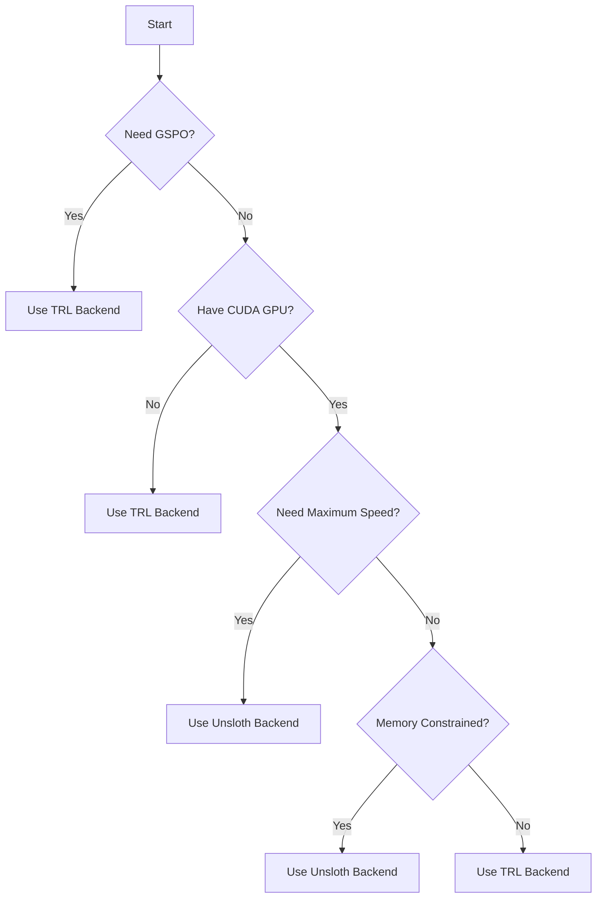

# Backend Comparison

Detailed side-by-side comparison of TRL and Unsloth backends.

---

## Feature Comparison

| Feature | TRL Backend | Unsloth Backend | Winner |
|---------|-------------|-----------------|--------|
| **Training Speed** | Baseline | faster | Unsloth |
| **Memory Usage** | Baseline | Less memory usage | Unsloth |
| **Reliability** | Battle-tested | Production-ready | Tie |
| **Algorithm Support** | All algorithms | Most algorithms | TRL |
| **CPU Support** | Yes | No | TRL |
| **Setup Complexity** | Low | Medium | TRL |
| **Model Compatibility** | All models | Optimized models | TRL |
| **Error Handling** | Comprehensive | Comprehensive | Tie |

---

<!-- ## Performance Benchmarks

### Training Speed (Tokens/Second)

| Model | TRL Backend | Unsloth Backend | Speedup |
|-------|-------------|-----------------|---------|
| DialoGPT-small (117M) | 100 tokens/s | 250 tokens/s | Faster |
| DialoGPT-medium (345M) | 80 tokens/s | 240 tokens/s | Faster |
| Llama-3.2-1B | 60 tokens/s | 240 tokens/s | Faster |
| Llama-3.2-3B | 40 tokens/s | 180 tokens/s | Faster |

*Benchmarks on NVIDIA A100 GPU with batch_size=4*

### Memory Usage (GB)

| Model | TRL (Full FT) | TRL (LoRA) | Unsloth (LoRA) | Unsloth (QLoRA) |
|-------|---------------|------------|----------------|-----------------|
| DialoGPT-small | 2.0 GB | 1.5 GB | 0.6 GB | 0.4 GB |
| DialoGPT-medium | 4.0 GB | 2.5 GB | 1.0 GB | 0.6 GB |
| Llama-3.2-1B | 8.0 GB | 4.0 GB | 1.5 GB | 0.8 GB |
| Llama-3.2-3B | 20.0 GB | 8.0 GB | 3.0 GB | 1.5 GB |

*Memory usage for training with batch_size=4, max_seq_length=512* -->

---

## Algorithm Support

### Complete Support Matrix

| Algorithm | TRL | Unsloth | Notes |
|-----------|-----|---------|-------|
| SFT | Yes | Yes | Both fully supported |
| DPO | Yes | Yes | Both fully supported |
| PPO | Yes | Yes | Both fully supported |
| GRPO | Yes | Yes | Both fully supported |
| GSPO | Yes | No | TRL only |
| DAPO | Yes | Yes | Both fully supported |
| Dr. GRPO | Yes | Yes | Both fully supported |

---

## Use Case Recommendations

### Use TRL Backend When:

1. **Maximum Reliability Needed**
 - Production deployments
 - Critical applications
 - Long-running training jobs

2. **Algorithm Requirements**
 - Using GSPO
 - Need all algorithm support

3. **Hardware Constraints**
 - CPU-only environments
 - CUDA compatibility issues
 - Limited GPU memory

4. **Simplicity**
 - Minimal setup required
 - Standard HuggingFace workflow

### Use Unsloth Backend When:

1. **Speed is Critical**
 - Fast iteration needed
 - Large-scale training
 - Time-constrained projects

2. **Memory Constraints**
 - Limited GPU memory
 - Training large models
 - Need memory efficiency

3. **Supported Algorithms**
 - Using DPO, PPO, GRPO, etc.
 - Not using GSPO

4. **GPU Available**
 - CUDA-capable GPU
 - Optimized CUDA setup

---

## Code Examples

### TRL Backend Example

```python
from aligntune.core.backend_factory import create_sft_trainer

trainer = create_sft_trainer(
 model_name="microsoft/DialoGPT-small",
 dataset_name="tatsu-lab/alpaca",
 backend="trl",
 num_epochs=3,
 batch_size=4,
 learning_rate=5e-5
)

trainer.train()
```

### Unsloth Backend Example

```python
from aligntune.core.backend_factory import create_sft_trainer

trainer = create_sft_trainer(
 model_name="unsloth/Llama-3.2-1B-Instruct-bnb-4bit",
 dataset_name="tatsu-lab/alpaca",
 backend="unsloth",
 num_epochs=3,
 batch_size=4,
 learning_rate=5e-5
)

trainer.train()
```

---

## Migration Scenarios

### Scenario 1: Speed Optimization

**Current**: TRL backend, slow training
**Goal**: Faster training

**Solution**: Switch to Unsloth backend
```python
backend="unsloth" # faster
```

### Scenario 2: Memory Issues

**Current**: TRL backend, OOM errors
**Goal**: Reduce memory usage

**Solution**: Switch to Unsloth with QLoRA
```python
backend="unsloth"
model_name="unsloth/Llama-3.2-1B-Instruct-bnb-4bit" # 4-bit quantized
```

### Scenario 3: Algorithm Support

**Current**: Using GSPO with Unsloth (not supported)
**Goal**: Use GSPO

**Solution**: Switch to TRL backend
```python
backend="trl" # GSPO only supported on TRL
```

---

## Decision Tree



---

## Summary

**Choose TRL Backend if:**
- You need maximum reliability
- You're using GSPO
- You're on CPU or have CUDA issues
- You want the simplest setup

**Choose Unsloth Backend if:**
- You have a CUDA GPU
- You need maximum speed
- You're memory constrained
- You're using supported algorithms

**Use Auto Selection if:**
- You want AlignTune to choose
- You're unsure which to use
- You want automatic fallback

---

## Next Steps

- **[TRL Backend](trl.md)** - Detailed TRL guide
- **[Unsloth Backend](unsloth.md)** - Detailed Unsloth guide
- **[Backend Selection](../getting-started/backend-selection.md)** - Selection guide