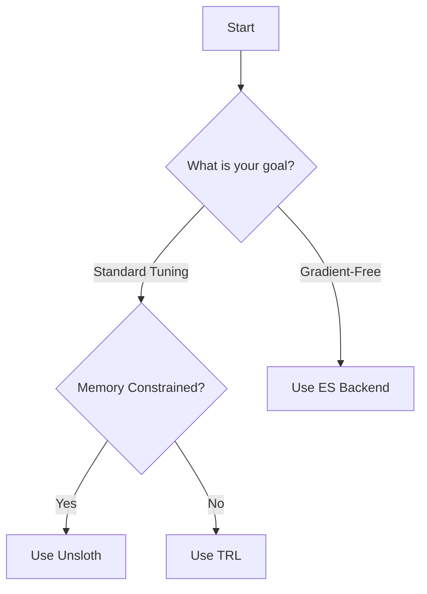

# Backend Comparison

Detailed side-by-side comparison of TRL, Unsloth, and ES backends.

---

## Feature Comparison

| Feature | TRL Backend | Unsloth Backend | ES Backend |
|---------|-------------|-----------------|------------|
| **Primary Use Case** | Generality, reliability | Speed, low memory | Gradient-free, black-box |
| **Training Speed** | Baseline | Faster | Moderate |
| **Memory Usage** | Baseline | Low | Low (No gradients) |
| **Algorithm Support** | All algorithms | Most algorithms | Any |
| **CPU Support** | Yes | No | Yes |
| **Setup Complexity** | Low | Medium | Low |

---

## Algorithm Support Matrix

| Algorithm | TRL | Unsloth | Notes |
|-----------|-----|---------|-------|
| **SFT** | ✅ | ✅ | |
| **DPO** | ✅ | ✅ | |
| **Online-DPO** | ✅ | ✅ | |
| **PPO** | ✅ | ✅ | |
| **GRPO** | ✅ | ✅ | |
| **GSPO** | ✅ | ✅ | |
| **DAPO** | ✅ | ✅ | |
| **Dr. GRPO**| ✅ | ✅ | |
| **GBMPO** | ✅ | ✅ | Supported via UnslothPlaceholder |
| **C-GRPO** | ✅ | ✅ | Counterfactual GRPO |
| **PACE** | ✅ | ✅ | |
| **ORPO** | ✅ | ✅ | |
| **SPIN** | ✅ | ✅ | |

*- Note: The ES backend (Evolution Strategies) is algorithm-agnostic and essentially replaces standard gradient descent algorithms entirely.*

---

## Decision Tree


```mermaid
flowchart TD
    Start[Start] --> Target{What is your goal?}
    
    Target -->|Standard Tuning| Mem{Memory Constrained?}
    Mem -->|Yes| Unsloth1[Use Unsloth]
    Mem -->|No| TRL1[Use TRL]
    
    Target -->|Gradient-Free| EsPath[Use ES Backend]
```

## Migration Scenarios

### Scenario 1: Transitioning to Unsloth for Memory
**Current**: TRL backend, OOM errors  
**Goal**: Reduce memory footprint  
**Solution**: 
```python
backend="unsloth"
model_name="unsloth/Llama-3.2-1B-Instruct-bnb-4bit" # 4-bit quantized
```

### Scenario 2: Non-Differentiable Rewards
**Current**: Reward function has discontinuities making gradients noisy.  
**Goal**: Optimize without backpropagation.  
**Solution**: Switch to ES backend  
```python
backend="es"
```