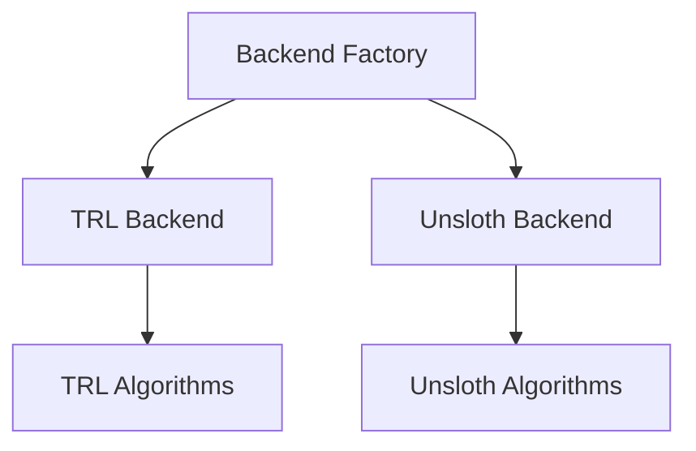

<p align="center">
 
</p>

<div style="text-align: center;">
 <a href="https://www.python.org/downloads/"></a>
 <a href="https://github.com/Lexsi-Labs/aligntune/blob/main/LICENSE"></a>
 <a href="https://badge.fury.io/py/aligntune"></a>
</div>

---

**AlignTune** is a production-ready fine-tuning library designed to simplify training and fine-tuning of Large Language Models (LLMs) with both Supervised Fine-Tuning (SFT) and Reinforcement Learning (RL) methods. 
It provides a high-level, unified API that abstracts away the complexities of backend selection, algorithm configuration, and training loops, letting you focus on delivering results.
Whether you are a practitioner aiming for production-grade pipelines or a researcher exploring advanced RLHF algorithms, AlignTune streamlines your workflow for LLM fine-tuning.

---

## Core Features

**Multi-Backend Architecture**: Choose between TRL (reliable, battle-tested) and Unsloth (faster) backends with intelligent auto-selection.

**Complete RLHF Coverage**: RL algorithms including DPO, PPO, GRPO, GSPO, DAPO, and Dr. GRPO.

**27+ Reward Functions**: Built-in reward functions for quality, safety, style, and task-specific metrics.

**Production-Ready**: No mock code, comprehensive error handling, extensive testing, and robust validation.

---

## Quick Start

```python
from aligntune.core.backend_factory import create_sft_trainer

# Create and train SFT model
trainer = create_sft_trainer(
 model_name="microsoft/DialoGPT-small",
 dataset_name="tatsu-lab/alpaca",
 backend="trl",
 num_epochs=3,
 batch_size=4,
 learning_rate=5e-5
)

# Train the model
trainer.train()

# Evaluate
metrics = trainer.evaluate()
print(metrics)
```

[Get Started →](getting-started/installation.md)

---

## Supported Algorithms

| Algorithm | TRL Backend | Unsloth Backend | Description |
|-----------|-------------|-----------------|-------------|
| **SFT** | Yes | Yes | Supervised Fine-Tuning |
| **DPO** | Yes | Yes | Direct Preference Optimization |
| **PPO** | Yes | Yes | Proximal Policy Optimization |
| **GRPO** | Yes | Yes | Group Relative Policy Optimization |
| **GSPO** | Yes | No | Group Sequential Policy Optimization (TRL only) |
| **DAPO** | Yes | Yes | Decouple Clip and Dynamic sAmpling Policy Optimization |
| **Dr. GRPO** | Yes | Yes | GRPO Done Right (unbiased variant) |

---

## Key Capabilities

- **Multiple Training Paradigms**: Supports SFT, DPO, PPO, GRPO, and advanced RL algorithms
- **Backend Flexibility**: TRL and Unsloth backends with automatic fallback
- **Reward Model Training**: Train custom reward models from rule-based functions
- **Comprehensive Evaluation**: Multi-level evaluation with lm-eval integration
- **Production Ready**: Model serialization, reproducible training, and deployment-ready pipelines
- **Extensible Architecture**: Modular design for easy integration of custom algorithms and backends

---

## Demo Notebooks

Interactive Colab notebooks demonstrating various AlignTune workflows:


### Supervised Fine-Tuning (SFT)

| Backend | Model | Dataset | Link |
|---------|-------|---------|------|
| TRL | Gemma-7b | philschmid/dolly-15k-oai-style (messages format) | [Open in Colab](https://colab.research.google.com/drive/1XYwChep74fhHi_g_gk4DNIFddStGUrF_?usp=sharing) |
| TRL | GemmaTX | TrialBench adverse event prediction | [Open in Drive](https://colab.research.google.com/drive/1GB2mpwfr3AO5N6LZkO8Fz9TXWjD5wuw1?usp=sharing) |
| Unsloth | Qwen-2.5-0.5-I | gaming | [Open in Colab](https://colab.research.google.com/drive/1BsJa4I41pLJ6-1HCy6BFInxdFOwddEv7?usp=sharing) |

### Reinforcement Learning (RL)

| Backend | Algorithm | Dataset | Link |
|---------|-----------|---------|------|
| TRL | DPO | hh-rlhf | [Open in Colab](https://colab.research.google.com/drive/1vLNVdGOkZhIBhKSqkL38IQQJ1TSwwK5g?usp=sharing) |
| TRL | GRPO | GSM8K | [Open in Colab](https://colab.research.google.com/drive/1kQnYc0AQW3DSsjcCYrqaGJiVwLr8B48O?usp=sharing) |
| TRL | PPO | openai_summarize_tldr | [Open in Colab](https://colab.research.google.com/drive/15WwkPYrz8YnR6wyQIqMb4kS7J-SrVArW?usp=sharing) |
| Unsloth | DPO | distilabel-intel-orca-dpo-pairs | [Open in Colab](https://colab.research.google.com/drive/1ukUkn98IlIfym_e3NbEY0vzhha3izmRW?usp=sharing) |
| Unsloth | GRPO | GSM8K | [Open in Colab](https://colab.research.google.com/drive/1x_PxjoIaFcZvjnlWKAA0nETGEMONlUoL?usp=sharing) |

---

## Explore the Documentation

- **[Getting Started](getting-started/installation.md)**: Installation, setup, and basic usage
- **[User Guide](user-guide/overview.md)**: In-depth tutorials for SFT and RL training
- **[API Reference](api-reference/overview.md)**: Complete Python API and class/method details
- **[Examples](examples/overview.md)**: End-to-end code examples
- **[Advanced Topics](advanced/architecture.md)**: Architecture, custom backends, and performance optimization
- **[Notebooks](notebooks/index.md)**: Interactive Colab notebooks and local Jupyter notebooks

---

## Architecture

AlignTune uses a flexible backend architecture:



**TRL Backend:** SFT, DPO, PPO, GRPO, GSPO, DAPO, Dr. GRPO

**Unsloth Backend:** SFT, DPO, PPO, GRPO, DAPO, Dr. GRPO

See [Architecture](advanced/architecture.md) for details.

---

## Why AlignTune?

- **No Boilerplate**: Avoids repetitive code for model-specific data loading, training, and inference
- **Consistent Results**: Automates best practices for RLHF research and model selection
- **Fast Iteration**: Easily compare different algorithms and backends with the same consistent API
- **Production Ready**: Model and config serialization for robust deployment and reproducibility
- **Community-Driven**: Extensible design and open contribution policy

---

## Contributing

We welcome contributions! See [Contributing Guide](contributing/guide.md) for details.

---

## License

This project is licensed under the AlignTune Source Available License (ASAL) v1.0 - see the [LICENSE](https://github.com/Lexsi-Labs/aligntune/blob/main/LICENSE) file for details.

---

## Citation

If you use AlignTune in your research, please cite:

**BibTeX:**
```bibtex
@software{alignTune2025,
 title = {AlignTune: A Comprehensive Fine-Tuning Library for SFT and RL Training},
 author = {Chawla, Chirag and Lyngkhoi, Zera and Seth, Pratinav and Avaiya, Utsav and Bhattacharjee, Soham and Khandoga, Mykola and Yuan, Rui and Sankarapu, Vinay Kumar},
 year = {2025},
 note = {Equal contribution: Chirag Chawla, Zera Lyngkhoi, Pratinav Seth},
 organization = {Lexsi Labs},
 url = {https://github.com/Lexsi-Labs/aligntune},
 version = {0.0.0}
}
```

**Plain Text:**
```
Chawla, C., Lyngkhoi, Z., Seth, P., Avaiya, U., Bhattacharjee, S., Khandoga, M.,
Yuan, R., & Sankarapu, V. K. (2025). AlignTune: A Comprehensive Fine-Tuning Library
for SFT and RL Training. Lexsi Labs. https://github.com/Lexsi-Labs/aligntune

*Equal contribution: Chirag Chawla, Zera Lyngkhoi, Pratinav Seth
```

---

## Acknowledgments

AlignTune is built upon the excellent work of the following projects:

- **[HuggingFace Transformers](https://github.com/huggingface/transformers)** - Model architectures and tokenizers
- **[TRL](https://github.com/huggingface/trl)** - Transformer Reinforcement Learning library
- **[Unsloth](https://github.com/unslothai/unsloth)** - Fast and memory-efficient training
- **[HuggingFace Datasets](https://github.com/huggingface/datasets)** - Dataset loading and processing

---

## Support

- **Documentation**: [docs.aligntune.io](https://docs.aligntune.io)
- **GitHub Issues**: [github.com/Lexsi-Labs/aligntune/issues](https://github.com/Lexsi-Labs/aligntune/issues)
- **Discussions**: [github.com/Lexsi-Labs/aligntune/discussions](https://github.com/Lexsi-Labs/aligntune/discussions)

---

**Get started with AlignTune and accelerate your LLM fine-tuning workflows today!**