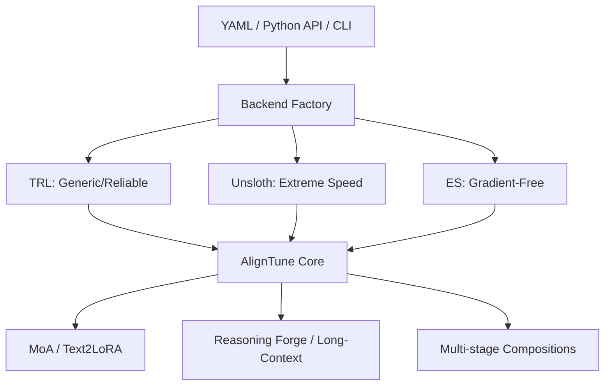

<div class="at-hero" markdown>


<p class="at-tagline">
AlignTune is a modular post-training ecosystem for LLMs: switch between SFT,
DPO, PPO, and 13+ RL algorithms with a single flag, route training through
TRL, Unsloth, or gradient-free backends, and keep one config format from
research to production.
</p>

[Get started](getting-started/installation.md){ .md-button .md-button--primary }
[View on GitHub](https://github.com/Lexsi-Labs/aligntune){ .md-button }

<p class="at-chips">
<span>Python 3.11+</span>
<span>TRL · Unsloth · ES backends</span>
<span>13+ RL algorithms</span>
<span>27+ reward functions</span>
<span>LSAL-1.1 (source available)</span>
</p>

</div>


```mermaid
flowchart TD
    User[YAML / Python API / CLI] --> Factory[Backend Factory]
    Factory --> TRL[TRL: Generic/Reliable]
    Factory --> Unsloth[Unsloth: Extreme Speed]
    Factory --> ES[ES: Gradient-Free]

    TRL & Unsloth & ES --> Core[AlignTune Core]

    Core --> Adapters[MoA / Text2LoRA]
    Core --> Subsystems[Reasoning Forge / Long-Context]
    Core --> Pipelines[Multi-stage Compositions]
```

<div class="grid cards" markdown>

-   :material-swap-horizontal-bold:{ .lg .middle } **Unified training API**

    ---

    Switch between SFT, DPO, Online-DPO, PPO, GRPO, ORPO, and more with a
    single `type` flag, no backend-specific rewrites.

-   :material-speedometer:{ .lg .middle } **Extreme optimization**

    ---

    Native Unsloth kernels give up to 2x faster training and 60% lower memory
    use, without changing your trainer config.

-   :material-toy-brick-outline:{ .lg .middle } **Utility ecosystem**

    ---

    Mixture-of-Adapters (MoA) and Text2LoRA/Doc2LoRA ship as composable
    building blocks, not separate forks.

-   :material-scale-balance:{ .lg .middle } **13+ RL algorithms**

    ---

    DPO, PPO, GRPO, GSPO, DAPO, Dr. GRPO, SPIN, RAFT, and more,
    each with a documented config surface.

-   :material-file-document-check-outline:{ .lg .middle } **27+ reward functions**

    ---

    Pre-built reward functions and a production-ready evaluation system for
    RL and preference-based fine-tuning.

-   :material-database-import:{ .lg .middle } **Any curated dataset**

    ---

    Alpaca, ShareGPT, DPO, and GRPO-formatted data load directly, including
    exports from [CuratorKIT](https://github.com/Lexsi-Labs/CuratorKIT).

-   :material-school-outline:{ .lg .middle } **Knowledge distillation**

    ---

    Standard and SDFT (self-distillation) trainers compress a teacher model
    into a smaller student. See [Distillation](advanced/distillation.md).

-   :material-merge:{ .lg .middle } **Model merging**

    ---

    Combine trained checkpoints or LoRA adapters with linear/task-arithmetic
    merging (via `mergekit`) or a dependency-free LoRA merge. See
    [Model Merging](advanced/merging.md).

-   :material-alphabetical-variant:{ .lg .middle } **Tokenizer adaptation**

    ---

    Extend a base model's vocabulary for a new language or domain, no
    retraining from scratch. See [Tokenization](advanced/tokenization.md).

</div>

## Sixty seconds

=== "Python"

    ```python
    from aligntune.core.backend_factory import create_sft_trainer

    trainer = create_sft_trainer(
        model_name="meta-llama/Llama-3.2-3B-Instruct",
        dataset_name="tatsu-lab/alpaca",
        backend="trl",       # or "unsloth" for faster training
        num_epochs=3,
        batch_size=4,
        learning_rate=5e-5,
        max_samples=1000,    # limit for a quick first run
    )

    trainer.train()
    ```

    The [quickstart guide](getting-started/quickstart.md) covers loading data,
    evaluating, and saving the trained model end to end.

=== "CLI"

    ```bash
    pip install aligntune

    aligntune train --model "microsoft/DialoGPT-small" \
      --dataset "tatsu-lab/alpaca" --type sft
    ```

    Config-driven runs are declarative YAML; the schema and full command
    reference are in the [CLI reference](cli-reference.md).

## Where next

<div class="at-wide" markdown>

| | |
|---|---|
| **[Getting started](getting-started/installation.md)** | Install, quickstart, backend selection |
| **[User guide](user-guide/overview.md)** | SFT and RL workflows in depth |
| **[Algorithm zoo](algorithms/overview.md)** | 13+ supported RL algorithms |
| **[API reference](api-reference/overview.md)** | Generated from the source docstrings |
| **[Examples](examples/overview.md)** | Runnable SFT, RL, and advanced recipes |

</div>

## Notebook recipes

50+ interactive Colab notebooks covering models, backends, and dataset
combinations live in the [notebooks index](notebooks.md).

---

## Cite

If you use AlignTune in your research, please cite the library:

```bibtex
@software{aligntune2026,
  author    = {Goyal, Bhavya and Lyngkhoi, Zera and Chawla, Chirag and Seth, Pratinav and Avaiya, Utsav and Bhattacharjee, Soham and Khandoga, Mykola and Yuan, Rui and Sankarapu, Vinay Kumar},
  title     = {AlignTune: Multi-Backend Alignment and Fine-Tuning Library for LLM Post-Training},
  year      = {2026},
  publisher = {Lexsi Labs},
  url       = {https://github.com/Lexsi-Labs/aligntune}
}
```

---

<div class="at-lexsi-footer" markdown>
<a href="https://www.lexsi.ai">
  
</a>
<p><a href="https://www.lexsi.ai">https://www.lexsi.ai</a></p>
<p>Mumbai 🇮🇳 · London 🇬🇧 · Paris 🇫🇷</p>
</div>
